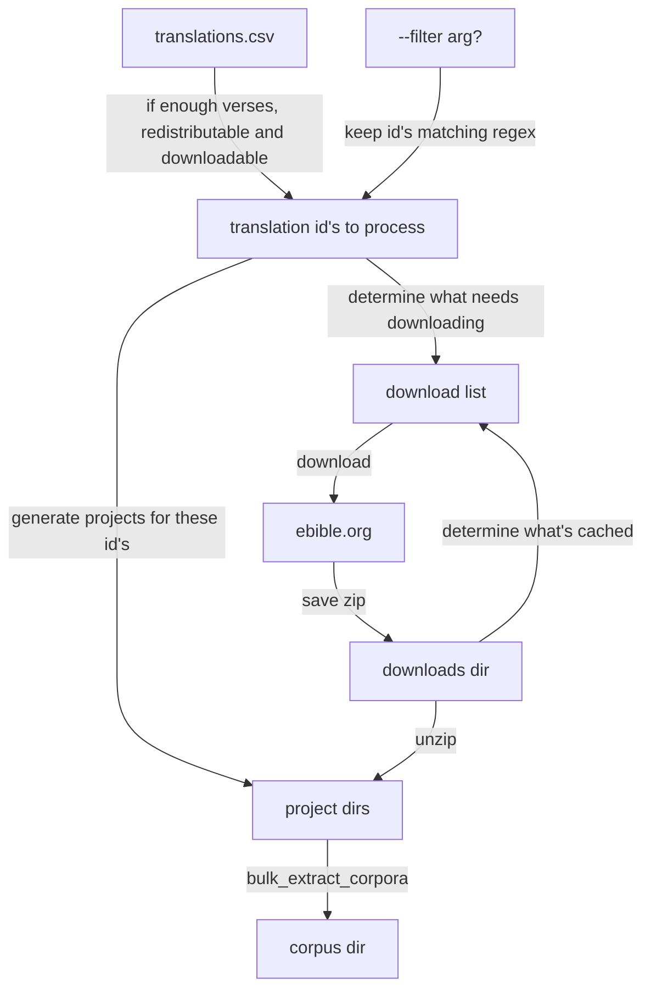

# eBible
This repo contains some of the scripts that create the data found in the [ebible_data](https://github.com/davidbaines/ebible_data) repository.

## Copyright Restrictions

The Bibles are collected from eBible.org either in the Public Domain, with a Creative Commons license, or with permission of the rights holder.

## Data Format

USFM files are downloaded from [eBible.org](https://ebible.org/), one zip file per Bible. We use bulk_extract_corpora.py from [SIL's NLP repo](https://github.com/sillsdev/silnlp/tree/master/silnlp/common/) to extract the verse text into the one verse per line format. 

### File Naming Convention

The extracted verse text from each Paratext resource is stored in a separate file.  The file naming convention follows the format:

  - \<languageCode\>-\<translation_id\>.txt (e.g., 'en-KJV.txt')

where:

  - \<languageCode\> is the 3-character ISO-639 abbreviation of the language of the verse text in the extract file
  - \<translation_id\> is taken from the translations.csv file downloaded from [ebible.org](https://ebible.org). 

### Verse References

Verse references are shown inthe in the _vref.txt_ file. The line number of the verse reference is the same for all corpus files.
GEN 1:1 is on the first line of every file, GEN 1:2 is on the second line and so on.

  - \<book\> \<chapter\>:\<verse\> (e.g., 'GEN 1:1')

where:

  - \<book\> is the 3 letter book abbreviation ([per USFM 3.0](https://ubsicap.github.io/usfm/identification/books.html));
  - \<chapter\> is the numeric chapter number;
  - \<verse\> is the numeric verse number.

### Missing Verses

Blank lines in the Bible text file indicate that the verse was not part of the source Bible.
  
### Verse Ranges
 
If a source Bible contained a verse range, with the text of several verses grouped together, then all of the verse text from the verse range will be found in the Bible text file on the line corresponding to the first verse in the verse range.  For each additional verse in the verse range, the token '&lt;range&gt;' will be found on the corresponding line of the Bible text file.  For example, if a source Bible contained Gen. 1:1-3 as a verse range, then the first 3 lines of its Bible text file will appear as follows:

    ...verse range text...
    <range>
    <range>

## Regenerating the corpus

The corpus needs to be regularly regenerated as the data on ebible.org changes over time.
Regenerating the corpus is done via a script: [ebible_status.py](./ebible_code/ebible_status.py).

To run it:


```
poetry run python ebible_data/ebible_status.py
```

The first run through of the script will setup a directory structure:

```
├── corpus
├── downloads
├── logs
├── metadata
├── private_corpus
├── private_projects
└── projects
```

### What the script does

In simple terms, the script:

- downloads a `translations.csv` file which outlines the currently available translations (in `metadata` dir)
- downloads zip files for each translation (in `downloads` dir)
- unpacks those zip files into paratext projects (in `projects` dir)
- constructs a licence file (in `metadata` dir)



### Building extracts

The building of the extracts is done by `bulk_extract_corpora` from the silnlp project.
It generates one extract file for each paratext projects.
The extracts are put into the data directory `corpus` dir.

Once you have checked the `corpus` dir, you would replace the checked in corpus dir with your newly generated one.

There is a [smoke_tests.py](./code/python/smoke_tests.py) script to help pick up common issues.

### Publishing to hugging face

TODO - add instructions

### Caching of zip files

The script caches downloaded zip files to:

- speed it up
- reduce the load put on ebible.org

The zip files are suffixed with a date representing the UTC date that they were downloaded,
e.g. if translation id `grc-tisch` was downloaded on April 5th 2023, the filename would be `grc-tisch--2023-04-05.zip`.

By default, the script will use the cached data for up to 14 days after it was downloaded.
This can be overridden, e.g. to set it to 30 days use `--max_zip_age_days 30`

Additionally the flag `--force_download` will ignore the cache and download everything fresh (including the `translations.csv` file).

The `--download-only` flag is useful when you want the script to just run the download logic then terminate without
building paratext projects.

### Filtering examples

The `--filter REGEX` reduces down the translation id's to just those that match the regex. 

This is useful when you are debugging/testing around particular translation id's.

This example picks out every translation id starting with "grc":

```
python ebible.py -f 'grc' PATH_TO_DATA_DIRECTORY

// Output
Command line filter used to reduce translation id's to ['grcbrent', 'grcbyz', 'grcf35', 'grcmt', 'grcsbl', 'grcsr', 'grctcgnt', 'grc-tisch', 'grctr']
```

This example matches just "gpu" (and not "gupk"):

```
$ python ebible.py -f 'gup$' PATH_TO_DATA_DIRECTORY

// Output
Command line filter used to reduce translation id's to ['gup']
```

This example matches translations id's starting with "gfk" or "hbo":

```
python ebible.py -f '(gfk|hbo)' PATH_TO_DATA_DIRECTORY

// Output
Command line filter used to reduce translation id's to ['gfk', 'gfkh', 'gfks', 'hbo', 'hboWLC']
```

### Built in filtering

The script automatically excludes some translations, for example:

- if they have too few verses
- they are marked as not downloadable in `translations.csv`
- they are not redistributable (this can be overridden with `--allow_non_redistributable`)
