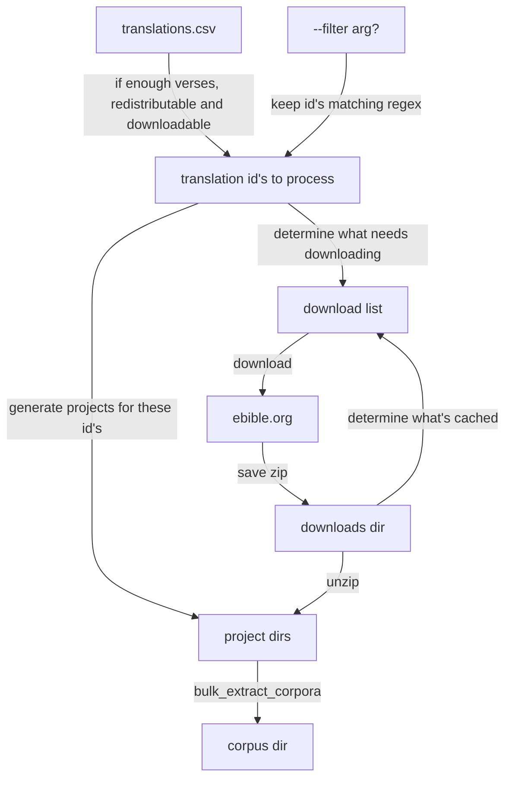

# eBible
This repo contains some of the scripts that create the data found in the [ebible_data](https://github.com/davidbaines/ebible_data) repository. The workflow relies on SILNLP's bulk_extract_corpora.py script to perform the Paratext-project-to-text file conversion. 

## Copyright Restrictions
The Bibles are collected from eBible.org either in the Public Domain, with a Creative Commons license, or with permission of the rights holder.

## Data Format
USFM files are downloaded from [eBible.org](https://ebible.org/), one zip file per Bible. We use bulk_extract_corpora.py from [SIL's NLP repo](https://github.com/sillsdev/silnlp/tree/master/silnlp/common/) to extract the verse text into the one verse per line format. 

### File Naming Convention
The SILNLP tool `bulk_extract_corpora.py` names the extracted text files with the format `<languageCode>-<project_folder_name>.txt`. The project folder names are typically the same as the `<translationId>`, which, is often the same as the languageCode, or begins with the languageCode. This results in names like `<languageCode>-<translationId>.txt` (e.g., `eng-KJV.txt` or `aai-aai.txt`).

After the SILNLP extraction, the `ebible.py` script is run a second time. This pass renames these files to remove any redundant leading `<languageCode>-` prefix if present, or simplifies names like `<languageCode>-<languageCode>.txt` to `<languageCode>.txt`.

The **final file naming convention** for files stored in the repository and referenced by `ebible_status.csv` is:
`<translationId>.txt` (e.g., `KJV.txt`, `aai.txt`, `abt-maprik.txt`)

where:
  - `<translationId>` is the identifier taken from the `translations.csv` file downloaded from ebible.org.

### Verse References
Verse references are shown inthe in the _vref.txt_ file. The line number of the verse reference is the same for all corpus files.
GEN 1:1 is on the first line of every file, GEN 1:2 is on the second line and so on.

  - \<book\> \<chapter\>:\<verse\> (e.g., 'GEN 1:1')

where:

  - \<book\> is the 3 letter book abbreviation ([per USFM 3.0](https://ubsicap.github.io/usfm/identification/books.html));
  - \<chapter\> is the numeric chapter number;
  - \<verse\> is the numeric verse number.

### Missing Verses
Blank lines in the Bible text file indicate that the verse is empty in the source Bible. This might be because it hasn't yet been translated and published.

### Verse Ranges
Verse ranges occur when several verses grouped together. This happens when translators find it more natural to combine the ideas of several verses or where a verse-by-verse translation is difficult. The text of all the verses in the verse range will be found in the Bible text file on the line corresponding to the first verse of the range.  For each additional verse in the verse range, the token '&lt;range&gt;' will be found on the corresponding line of the Bible text file.  For example, if a source Bible contained Gen. 1:1-3 as a verse range, then the first 3 lines of its Bible text file will appear as follows:

    ...verse range text...
    <range>
    <range>

## What the ebible script does and how to use it.

Download the translations.csv file from ebible.org to find the list of translations.

Create ebible_status.csv with the information from the translations.csv as a starting point. This file keeps track of the progress of each translation through the 'pipeline'.

Download the zipped translations and unzip them - the unzipped folders each contain a translation project - these are treated as Paratext-format project folders.

Prepare the Project Folders: For each newly downloaded or unzipped translation, the script performs several tasks:
  a. Rename USFM Files to ensure consistency for subsequent processing. 
  b. Find the list of chapters and verses that exist in each project as step towards determining the versification used by the translation. These are saved in the metadata folder in a file called compare_versifications.csv.
  c. Calculate the best versification and use it when writing the Settings.xml for each project. Settings.xml includes important metadata for SIL tools, such as the language code, the versification and the filenaming convention.
  d. Extract License Information: The script parses the copr.htm file from the project folder and extract copyright statements, Creative Commons license details and save this summary of the licence information in the ebible_status.csv.
  e. The code should then extract the project data into the vref, or one verse per line, format that is used by SILNLP. This effectively creates a multilingual parallel corpus since every verse from each translation is on the same line number in each text file of the corpus. These output files are placed in the corpus folder (for public data) or to the private_corpus folder (for private data).  
  
## ebible_status.csv 
Throughout all these stages, ebible_status.csv serves as the central ledger. It's continuously updated to reflect:

Dates of various operations (download, unzip, license check, settings file creation, corpus file creation).
Paths to downloaded zip files, unzipped project folders, and final corpus text files.
Metadata such as the license details and inferred versification. 

Any errors encountered during the processing of a specific translation, which helps in debugging and allows the script to skip previously failed items on subsequent runs. This status file is crucial for the script's ability to resume processing, avoid redundant work, and manage the workflow.

# Special Operational Mode - Update Settings.
With the command line option --update-settings ebible.py only updates the Settings.xml file for each project.
When run in this mode ebible.py: 
It bypasses the download, unzip, and full processing pipeline. Instead, it iterates through all existing project folders (both public and private). 
For each project, it regenerates the Settings.xml file (and the associated project-specific .vrs file if it's missing or needs an update). This is useful for applying new logic for versification scoring or other settings changes across all previously processed translations.
It updates ebible_status.csv with the new settings file date and any changed versification information.
A report detailing the changes made to settings files (settings_update.csv) is generated.
The script then prints the SILNLP commands and exits.


To run it:
```
poetry run python ebible_code/ebible.py
```

EBIBLE_DATA_DIR should be set in the .env file and point to a folder containing a local copy of the eBIBLE_data repo. If required folders are missing then the script create a directory structure in EBIBLE_DATA_DIR as follows:

```
├── corpus
├── downloads
├── logs
├── metadata
├── private_corpus
├── private_projects
└── projects
```

### What the script does
In simple terms, the script:

- downloads a `translations.csv` file which outlines the currently available translations (in `metadata` dir)
- downloads zip files for each translation (in `downloads` dir)
- unpacks those zip files into paratext projects (in `projects` dir)
- constructs a licence file (in `metadata` dir)



### Building extracts
The building of the extracts is done by `bulk_extract_corpora` from the silnlp project.
It generates one extract file for each paratext projects.
The extracts are put into the data directory `corpus` dir.

Once you have checked the `corpus` dir, you would replace the checked in corpus dir with your newly generated one.

There are smoke tests in (test_smoke.py](./tests/test_smoke.py) to help pick up common issues. #TODO-check

### Publishing to hugging face
The corpus_to_parquet.py script will convert the ebible_data/corpus files into a parquet file ready for uploading to HuggingFace as a dataset.
It will also create a parquet file from the data in the ebible_data/metadata/eBible Corpus Metadata.xlsx file. #TODO add a data filtering and loading script for HuggingFace.

### Caching of zip files
The script caches downloaded zip files to:

- speed it up
- reduce the load on ebible.org

The zip files are suffixed with a date representing the UTC date that they were downloaded,
e.g. if translation id `eng-KJV` was downloaded on April 5th 2023, the filename would be `eng-KJV--2023-04-05.zip`.

By default, the script will use the cached data for up to 14 days after it was downloaded.
This can be overridden, e.g. to set it to 30 days use `--max_zip_age_days 30`

Additionally the flag `--force_download` will ignore the cache and download everything fresh (including the `translations.csv` file).

The `--download-only` flag is useful when you want the script to just run the download logic alone, without extracting them to paratext projects.

### Filtering examples
The `--filter REGEX` reduces down the translation id's to just those that match the regex. 

This is useful when you are debugging/testing around particular translation id's.
This example picks out every translation id starting with "grc":

```
python ebible.py -f 'grc' PATH_TO_DATA_DIRECTORY

// Output
Command line filter used to reduce translation id's to ['grcbrent', 'grcbyz', 'grcf35', 'grcmt', 'grcsbl', 'grcsr', 'grctcgnt', 'grc-tisch', 'grctr']
```

This example matches just "gpu" (and not "gupk"):

```
$ python ebible.py -f 'gup$' PATH_TO_DATA_DIRECTORY

// Output
Command line filter used to reduce translation id's to ['gup']
```

This example matches translations id's starting with "gfk" or "hbo":

```
python ebible.py -f '(gfk|hbo)' PATH_TO_DATA_DIRECTORY

// Output
Command line filter used to reduce translation id's to ['gfk', 'gfkh', 'gfks', 'hbo', 'hboWLC']
```

### Built in filtering
The script automatically excludes some translations, for example:

- if they have too few verses
- they are marked as not downloadable in `translations.csv`
- they are not redistributable (this can be overridden with `--allow_non_redistributable`)
